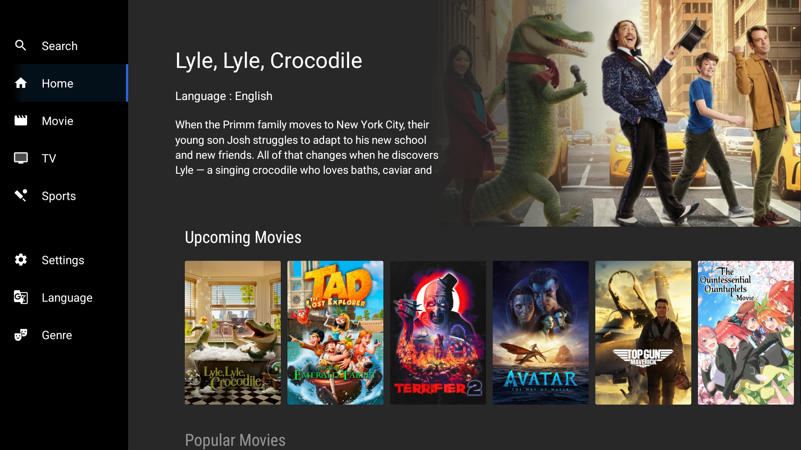
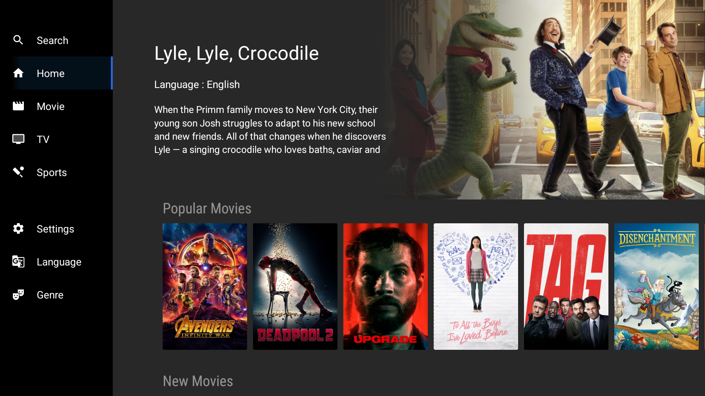
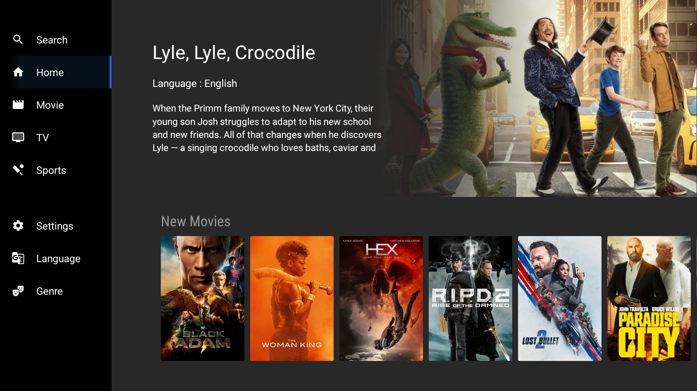
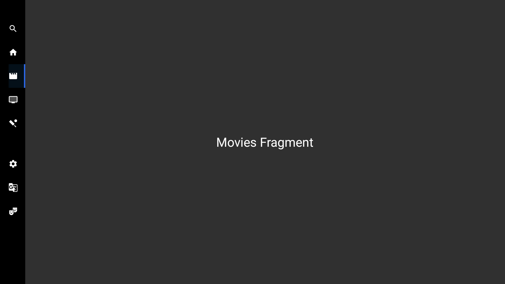

Android TV SAMPLE
==================

This sample app of videos, designed to run on an Android TV device, which demonstrates how to use the Leanback Support library which enables you to easily develop beautiful Android TV apps with a user-friendly UI that complies with the UX guidelines of Android TV.

The `MainActivity.kt` consist of leanback `BrowseFrameLayout`, that helping to show the navigation menu options and `FrameLayout` used for holding the different `fragments`.

The `HomeFragment` extents `Fragment` and attached the custom XML layout which consist of title, subtitle, description, banner image and `FragmentContainerView` used for holding the `ListFragment`

The `ListFragment` extents `RowsSupportFragment` for displaying different cards.

The `SearchFragment`,`MovieFragment`,`SportsFragment`, etc.. extents `Fragment` for displaying dummy contents.

## Screenshots





- 
### Find this project useful ? :heart:

* Support it by clicking the :star: button on the upper right of this page. :v:


You can connect with me on:

- [Twitter](https://twitter.com/AMANJHAM)
- [LinkedIn](https://www.linkedin.com/in/aman-jham-9436276a/)
- [GitHub](https://github.com/aman-jham)

### License

```
   Copyright (C) 2023 Aman Jham

   Licensed under the Apache License, Version 2.0 (the "License");
   you may not use this file except in compliance with the License.
   You may obtain a copy of the License at

       http://www.apache.org/licenses/LICENSE-2.0

   Unless required by applicable law or agreed to in writing, software
   distributed under the License is distributed on an "AS IS" BASIS,
   WITHOUT WARRANTIES OR CONDITIONS OF ANY KIND, either express or implied.
   See the License for the specific language governing permissions and
   limitations under the License.
```